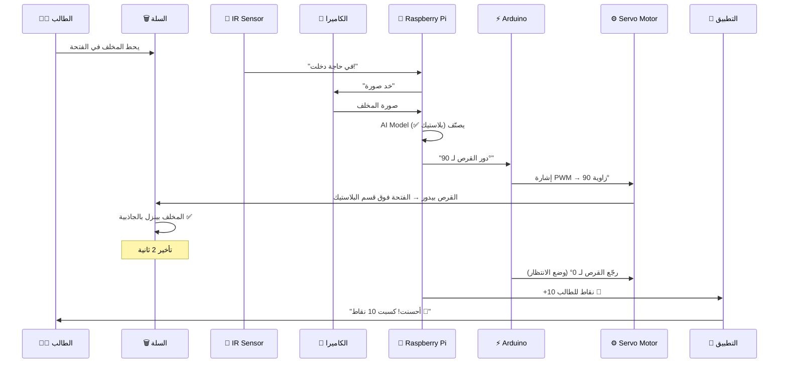

# ⚙️ ميكانيكا السلة الذكية — كيف يعمل الفرز التلقائي؟

## 🔄 الفكرة الأساسية

المبدأ بسيط: **الطالب يحط المخلف في فتحة واحدة ← الكاميرا/السنسور يتعرف على نوعه ← ميكانيزم ميكانيكي يحركه للقسم الصح.**

السؤال هو: إيه الميكانيزم الميكانيكي ده؟ فيه 3 تصاميم رئيسية، وهشرحلك كل واحد بالتفصيل.

---

## 🏗️ التصميم 1: القرص الدوّار (Rotating Disk) — ⭐ الأنسب ليكم

> [!TIP]
> **ده التصميم اللي بنصحكم بيه** — أبسط في التنفيذ، أرخص، وبيدّي شكل احترافي في العرض.

### كيف بيشتغل؟

```
              ┌──────────────────────────────┐
              │      فتحة الإدخال (أعلى)       │
              │    ┌───────────────────┐       │
              │    │  📸 كاميرا + سنسور │       │
              │    └────────┬──────────┘       │
              │             │                  │
              │       ▼ مخلف بينزل             │
              │                                │
              │    ┌────────────────────┐       │
              │    │  🔄 قرص دوّار      │       │
              │    │   (Rotating Disk)  │       │
              │    │                    │       │
              │    │  فيه فتحة واحدة    │       │
              │    │  بتتحرك فوق       │       │
              │    │  القسم المطلوب     │       │
              │    └────────────────────┘       │
              │             │                  │
              │    ┌──┬──┬──┬──┐               │
              │    │🥤│📄│🥫│🍌│               │
              │    │بلا│ورق│معدن│عضو│            │
              │    │ستيك│   │   │ي  │            │
              │    └──┴──┴──┴──┘               │
              └──────────────────────────────┘
```

### خطوات العمل بالتفصيل:

```
الخطوة 1: الطالب يحط المخلف في الفتحة العلوية
         ↓
الخطوة 2: سنسور IR بيحس إن في حاجة دخلت
         ↓
الخطوة 3: الكاميرا بتاخد صورة + الـ AI بيصنّف النوع
         (بلاستيك؟ ورق؟ معدن؟ عضوي؟)
         ↓
الخطوة 4: Raspberry Pi بيبعت أمر لـ Servo Motor
         "دور القرص لزاوية 90°" (مثلاً للبلاستيك)
         ↓
الخطوة 5: الـ Servo بيدور القرص → الفتحة بتتحط فوق
         قسم البلاستيك بالظبط
         ↓
الخطوة 6: المخلف بينزل بالجاذبية في القسم الصح ✅
         ↓
الخطوة 7: القرص يرجع للوضع الافتراضي (انتظار)
```

### تفاصيل القرص:

```
              منظر من فوق (Top View)
        ┌─────────────────────────────┐
        │                             │
        │         ╭───────╮           │
        │       ╱     ┃     ╲         │
        │     ╱   0°  ┃ 90°  ╲       │
        │    │ (بلاستيك)┃(ورق)  │      │
        │    │─────────╋────────│      │
        │    │  270°   ┃ 180°  │      │
        │    │ (عضوي)  ┃(معدن)  │      │
        │     ╲       ┃      ╱       │
        │       ╲     ┃    ╱         │
        │         ╰───────╯           │
        │              ⬆              │
        │      محور الدوران           │
        │     (Servo Motor)           │
        └─────────────────────────────┘

   → القرص فيه فتحة واحدة (ثقب)
   → الـ Servo بيدور القرص
   → الفتحة بتقف فوق القسم المطلوب
   → المخلف بينزل فيه بالجاذبية
```

### المكونات المطلوبة:

| المكون | الموديل | السعر التقريبي | من فين |
|:---|:---|:---|:---|
| Servo Motor (عزم عالي) | **MG996R** أو **MG995** | 80-150 ج.م | رام إلكترونيكس / أمازون مصر |
| سنسور كشف معدن | **Inductive Proximity LJ12A3** | 50-100 ج.م | رام إلكترونيكس |
| سنسور كشف وجود | **IR Obstacle Sensor** | 15-30 ج.م | رام إلكترونيكس |
| سنسور رطوبة | **Soil Moisture Sensor** | 20-40 ج.م | رام إلكترونيكس |
| قرص خشب/أكريليك | قص ليزر أو تصنيع يدوي | 100-300 ج.م | ورشة نجارة / قص ليزر |
| محور دوران + رولمان بلي | Bearing + shaft | 50-100 ج.م | محل مستلزمات ميكانيكية |

---

## 🏗️ التصميم 2: الفلابات المتحركة (Flap Diverters)

### كيف بيشتغل؟

```
              ┌──────────────────────────────┐
              │      فتحة الإدخال (أعلى)       │
              │    ┌───────────────────┐       │
              │    │  📸 كاميرا + سنسور │       │
              │    └────────┬──────────┘       │
              │             │                  │
              │       ▼ مخلف بينزل             │
              │             │                  │
              │    ┌────────┴────────┐         │
              │    │                 │         │
              │  ╱╱  Flap 1        ╲╲         │
              │ ╱    (Servo 1)       ╲        │
              │╱                       ╲       │
              │    ┌──────┴──────┐     │       │
              │  ╱╱  Flap 2    ╲╲     │       │
              │ ╱                 ╲    │       │
              │                        │       │
              │ ┌──┐ ┌──┐   ┌──┐ ┌──┐ │       │
              │ │🥤│ │📄│   │🥫│ │🍌│ │       │
              │ └──┘ └──┘   └──┘ └──┘ │       │
              └──────────────────────────────┘
```

### الفكرة:
- فيه **2-3 فلابات (بوابات)** متركبة بزاوية
- كل فلاب متحكم فيها **Servo Motor** منفصل
- لما الـ AI يحدد النوع، بيفتح الفلابات بتسلسل معين عشان يوجه المخلف
- **مثال:** لو بلاستيك → Flap 1 يميل يمين + Flap 2 يميل شمال = المخلف بينزل في قسم البلاستيك

### عيوبه:
- محتاج **أكتر من Servo** (2-3 على الأقل)
- التحكم أعقد (تسلسل فتح وقفل)
- ممكن المخلفات الكبيرة تعلق في الفلابات

---

## 🏗️ التصميم 3: السير الناقل (Conveyor Belt)

### كيف بيشتغل؟

```
    📸 كاميرا
      │
      ▼
 ═══════════════════════════════►  سير ناقل (Conveyor Belt)
      │         │         │
      ▼         ▼         ▼
   ╱Flap 1╲ ╱Flap 2╲ ╱Flap 3╲    ← فلابات جانبية
      │         │         │
   ┌──┐     ┌──┐     ┌──┐
   │🥤│     │📄│     │🥫│        ← أقسام الفرز
   └──┘     └──┘     └──┘
```

### الفكرة:
- المخلف بيتحط على سير ناقل متحرك
- الكاميرا بتتعرف عليه وهو ماشي
- لما يوصل للقسم الصح، فلاب جانبية بتزقه من على السير

### عيوبه:
- **أغلى وأعقد** بكتير (محتاج DC Motor + سير + هيكل كبير)
- محتاج مساحة أكبر
- **مش عملي لسلة زبالة** — ده أنسب للمصانع

---

## ⚖️ مقارنة بين التصاميم الثلاثة

| المعيار | القرص الدوّار ⭐ | الفلابات | السير الناقل |
|:---|:---:|:---:|:---:|
| **سهولة التنفيذ** | ⭐⭐⭐⭐⭐ | ⭐⭐⭐ | ⭐⭐ |
| **التكلفة** | منخفضة (~500 ج.م) | متوسطة (~800 ج.م) | عالية (~2000+ ج.م) |
| **عدد المحركات** | 1 Servo فقط | 2-3 Servos | 1 DC Motor + 2-3 Servos |
| **الحجم** | صغير (يصلح كسلة) | متوسط | كبير |
| **الموثوقية** | عالية | متوسطة (تعليق) | عالية |
| **الشكل في العرض** | ممتاز 🏆 | جيد | مبهر لكن ضخم |
| **مناسب للجامعة** | ✅ جداً | ✅ مقبول | ❌ مش عملي |

> [!IMPORTANT]
> **التوصية:** استخدموا **التصميم 1 (القرص الدوّار)** — أبسط، أرخص، أسهل في الشرح للجنة التحكيم، ومناسب كسلة زبالة حقيقية.

---

## 🛒 هل في حاجة جاهزة نشتريها؟

### الخبر السيء:
المنتجات التجارية الكاملة زي **Bin-e** و **TrashBot** هي منتجات **B2B Enterprise** مش للأفراد:
- **Bin-e:** سعرها بيبدأ من **$2,000-$5,000+** ولازم تتواصل مع الشركة
- **TrashBot:** مفيش سعر ثابت — عقد خدمة مع الشركة
- **مش متاحة للشراء المباشر** — لازم consultation + تخصيص

### الخبر الحلو:
على **Alibaba** و **Made-in-China** فيه حاجات تقدروا تستفيدوا منها:

| المنتج | السعر التقريبي | الرابط |
|:---|:---|:---|
| Smart Sensor Trash Can (بسنسور فتح) | $5 - $150 | ابحث على Alibaba: "smart sensor trash can" |
| Multi-compartment Smart Bin | $500 - $2,500 | ابحث: "automatic waste sorting bin" |
| AI Waste Sorting Machine (صناعي) | $2,000 - $30,000 | ابحث: "AI waste classification sorting machine" |

> [!WARNING]
> **لكن أنا مش بنصحكم تشتروا حاجة جاهزة!** والسبب:
> 1. لجنة التحكيم عايزة تشوف **ابتكار** مش منتج مشتري
> 2. بناء النموذج بنفسكم **بيبيّن المهارة التقنية** وده بيفرق في التقييم
> 3. التكلفة هتكون **أقل بكتير** لو عملتوه بنفسكم
> 4. تقدروا **تخصصوه** لاحتياجات الجامعة المصرية الصينية

---

## ✅ الخطة العملية: اعملوها بنفسكم (DIY)

### المكونات الكاملة لنموذج القرص الدوّار:

```
┌─────────────────────────────────────────────────────────┐
│                  قائمة المشتريات                          │
├─────────────────────────────────────────────────────────┤
│                                                         │
│  🧠 المعالجة والتحكم:                                    │
│  ├── Raspberry Pi 4 (4GB)         → ~2,500 ج.م          │
│  ├── Arduino Uno                   → ~250 ج.م           │
│  └── USB Cable (Pi ↔ Arduino)      → ~30 ج.م            │
│                                                         │
│  📸 التصنيف:                                              │
│  ├── Pi Camera Module V2           → ~350 ج.م           │
│  ├── Inductive Proximity Sensor    → ~80 ج.م            │
│  └── IR Obstacle Sensor (×2)       → ~40 ج.م            │
│                                                         │
│  ⚙️ الميكانيكا:                                           │
│  ├── Servo Motor MG996R            → ~120 ج.م           │
│  ├── Bearing (رولمان بلي)           → ~50 ج.م           │
│  ├── قرص خشب/أكريليك (قص ليزر)     → ~200 ج.م          │
│  └── هيكل السلة (خشب/MDF)          → ~400 ج.م          │
│                                                         │
│  📡 الاتصال:                                              │
│  └── ESP32 (WiFi + Bluetooth)      → ~200 ج.م           │
│                                                         │
│  📊 العرض:                                                │
│  ├── LCD Screen 16×2 (I2C)         → ~60 ج.م            │
│  └── LEDs (أخضر/أحمر/أصفر)         → ~20 ج.م            │
│                                                         │
│  🔌 الطاقة:                                               │
│  ├── Power Supply 5V/3A            → ~80 ج.م            │
│  └── Wires + Breadboard            → ~50 ج.م            │
│                                                         │
│  ─────────────────────────────────────────────           │
│  💰 الإجمالي التقريبي:  ~4,430 ج.م                       │
│     (حوالي $90)                                          │
└─────────────────────────────────────────────────────────┘
```

### من فين تشتروا في مصر؟
1. **رام إلكترونيكس** (Ram Electronics) — باب اللوق، القاهرة
2. **فتح الله إلكترونيكس** — العتبة
3. **أمازون مصر** (amazon.eg)
4. **جوميا مصر** (jumia.com.eg)
5. **AliExpress** (لو عندكم وقت للشحن — 2-3 أسابيع)

---

## 🔧 تفصيل آلية العمل الكاملة (Step by Step)



### التوزيع بين Raspberry Pi و Arduino:

```
┌─────────────────────────────────┐    USB Serial    ┌──────────────────────────┐
│        Raspberry Pi 4            │ ◄──────────────► │      Arduino Uno          │
│                                  │                  │                           │
│  المهام:                          │                  │  المهام:                    │
│  ├── تشغيل الكاميرا              │                  │  ├── التحكم في Servo       │
│  ├── تشغيل AI Model             │                  │  ├── قراءة IR Sensor       │
│  ├── التواصل مع الـ Cloud        │                  │  ├── قراءة Metal Sensor    │
│  ├── إرسال النقاط للتطبيق        │                  │  ├── التحكم في LEDs       │
│  └── إرسال أمر الفرز لـ Arduino  │                  │  └── عرض على LCD Screen   │
└─────────────────────────────────┘                  └──────────────────────────┘
```

### ليه بنستخدم الاتنين مع بعض؟
- **Raspberry Pi** = كمبيوتر صغير — بيشغل Linux + Python + AI → بطيء في التحكم في الـ Hardware مباشرة
- **Arduino** = متحكم دقيق — سريع جداً في التحكم في Motors و Sensors → مش بيشغل AI
- **الحل:** Pi بيفكر 🧠 + Arduino بينفذ ⚡

---

## 🔑 تفصيل مهم: إزاي الـ AI بيتعرف على المخلف؟

### الطريقة 1: Computer Vision (الأساسية) 📸
```
صورة المخلف → YOLOv8/MobileNet → "بلاستيك 94%"
```
- بتستخدم كاميرا + نموذج AI متدرب على صور مخلفات
- **Dataset جاهز:** TrashNet (2,527 صورة مصنفة) على GitHub
- بتشتغل على Raspberry Pi باستخدام TensorFlow Lite
- **الدقة:** 85-95% حسب جودة التدريب

### الطريقة 2: سنسورات فيزيائية (مساعدة) 🔧
```
Inductive Sensor → "معدن ✅" (بيحس بالمعادن)
Moisture Sensor  → "عضوي ✅" (بيحس بالرطوبة)
Weight Sensor    → بيساعد في التأكيد
```

### التوصية: اجمعوا الطريقتين! 🏆
```
الكاميرا (AI) + Inductive Sensor (معادن) + Moisture Sensor (عضوي)
     ↓                    ↓                        ↓
   الأساسي            تأكيد إضافي              تأكيد إضافي
     ↓                    ↓                        ↓
         ────────── القرار النهائي ──────────
                 دقة أعلى من 95% ✅
```

> [!TIP]
> الجمع بين AI + سنسورات فيزيائية هيرفع الدقة ويبيّن للجنة إنكم فاهمين إن الـ AI لوحده مش كافي.

---

## 🎥 فيديوهات مفيدة (ابحثوا عنها على YouTube)

ابحثوا بالعبارات دي على YouTube وهتلاقوا tutorials كاملة:

| عبارة البحث | هتلاقوا إيه |
|:---|:---|
| `"Arduino automatic waste segregator rotating disk"` | تصميم القرص الدوّار |
| `"DIY smart bin sorting mechanism servo"` | آلية الفرز بالسيرفو |
| `"Raspberry Pi waste classification AI camera"` | تدريب الـ AI |
| `"How to build a waste sorting machine Arduino"` | المشروع كامل |
| `"smart dustbin using Arduino servo motor"` | مشاريع بسيطة |
| `"YOLOv8 waste detection Raspberry Pi"` | التعرف بالكاميرا |

> [!NOTE]
> كتير من الـ YouTubers بيحطوا **الكود + مخطط الدوائر** في وصف الفيديو أو في رابط GitHub/Google Drive. استفيدوا منهم!

---

## 🎯 الخلاصة

| السؤال | الإجابة |
|:---|:---|
| التصميم الأنسب؟ | **القرص الدوّار** — سيرفو واحد + قرص خشب |
| فيه حاجة جاهزة؟ | أيوه بس **غالية جداً** ($2,000+) ومش هتفيدكم في المسابقة |
| نعملها بنفسنا؟ | **أيوه 100%** — التكلفة ~4,500 ج.م والنتيجة أحسن في التقييم |
| أقدر أبدأ فوراً؟ | أيوه — اشتروا Raspberry Pi + Arduino + Servo وابدأوا |
