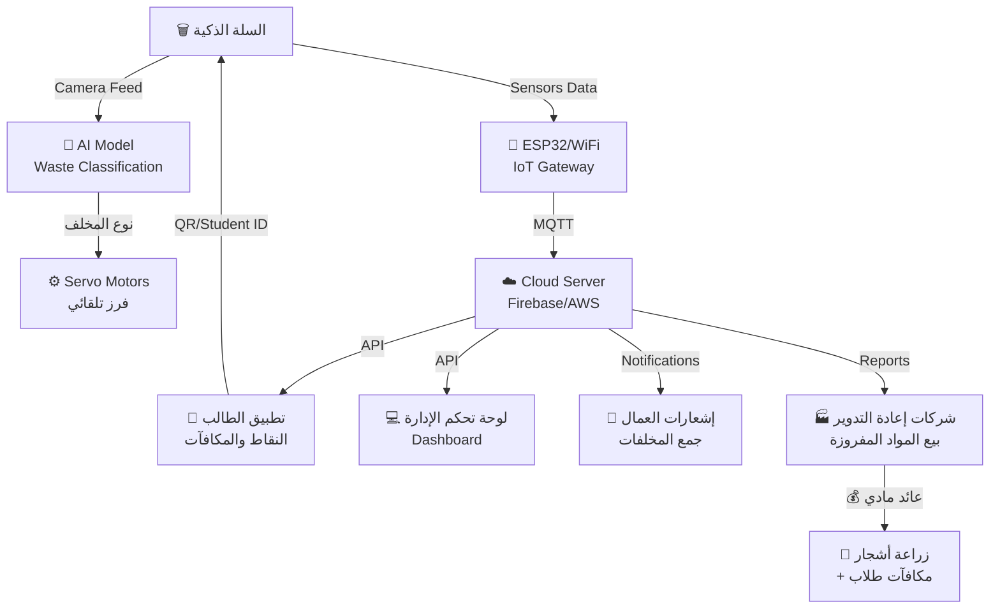

# 🏆 تقييم فكرة مشروع "سلة الفرز الذكية" - هاكاثون الجامعة المصرية الصينية

## ✅ التقييم العام: فكرة ممتازة وقابلة للتنفيذ (8.5/10)

> [!TIP]
> الفكرة قوية جداً لأنها تغطي **المسارات الأربعة** للمسابقة في مشروع واحد متكامل، وده ميزة تنافسية كبيرة جداً.

---

## 📊 تغطية مسارات المسابقة الأربعة

| المسار | كيف فكرتكم بتغطيه | التقييم |
|:---|:---|:---:|
| **1. التكنولوجيا الذكية** | الـ AI/Computer Vision للتعرف على نوع المخلفات + IoT Sensors + تطبيق موبايل | ⭐⭐⭐⭐⭐ |
| **2. الابتكار الهندسي** | تصميم السلة الذكية بأقسام متعددة + آلية الفرز الأوتوماتيكية | ⭐⭐⭐⭐ |
| **3. التصميم الإبداعي** | نظام النقاط والـ Gamification + واجهة التطبيق التفاعلية | ⭐⭐⭐⭐ |
| **4. النماذج الاقتصادية الخضراء** | بيع المخلفات المفروزة + زراعة أشجار + دورة اقتصادية مستدامة | ⭐⭐⭐⭐⭐ |

---

## 🌍 أنظمة مشابهة موجودة فعلاً (مرجع للتنفيذ)

### 1. Bin-e (بولندا/ألمانيا) 🇵🇱🇩🇪
- **الأقرب لفكرتكم** — سلة ذكية بتفرز تلقائياً باستخدام AI
- كاميرا + ذكاء اصطناعي بيتعرف على نوع المخلف (بلاستيك، ورق، معدن، زجاج) بدقة **92-95%**
- بتضغط المخلفات تلقائياً لتقليل الحجم
- متصلة بالـ Cloud لمراقبة مستوى الامتلاء
- **الأبعاد:** 120cm × 120cm × 60cm
- **الموقع:** [bine.world](https://bine.world)

### 2. TrashBot (أمريكا) 🇺🇸
- من شركة CleanRobotics
- بتستخدم Computer Vision + روبوتات للفرز التلقائي
- دقة تصل إلى **96%**
- منتشرة في المطارات والجامعات

### 3. Oscar Sort (كندا) 🇨🇦
- من شركة Intuitive AI
- بتستخدم كاميرا + شاشة تفاعلية لتوجيه المستخدم
- **مطبقة في جامعات:** UW–Madison, Arizona State, University of Kentucky
- فيها عنصر Gamification وتعليمي

### 4. نظام Pfand الألماني 🇩🇪
- **ده اللي كنت بتتكلم عنه** — نظام إرجاع الزجاجات في ألمانيا
- المستهلك بيدفع deposit (من €0.08 لـ €0.25) على كل زجاجة
- لما يرجعها في ماكينة Reverse Vending Machine، بياخد فلوسه
- نسبة الإرجاع وصلت **98%+**
- ممكن نستلهم منه فكرة الـ reward system

> [!IMPORTANT]
> **ميزتكم التنافسية:** معظم الأنظمة دي بتركز على الفرز بس. فكرتكم بتضيف **الدورة الاقتصادية الكاملة** (فرز ← بيع ← زراعة ← مكافآت) وده اللي بيميزكم.

---

## 💡 اقتراحات لتقوية الفكرة

### اقتراحات أساسية (لازم تنفذوها):

#### 1. اسم المشروع
اقتراح اسم جذاب: **"إيكو سورت - EcoSort"** أو **"جرين بوينت - GreenPoint"** أو **"فارز - Farez"**
> اختاروا اسم عربي/إنجليزي يكون سهل ويعلق في الدماغ

#### 2. Dashboard لإدارة الجامعة
- لوحة تحكم ويب تعرض:
  - كمية المخلفات المجمعة يومياً/أسبوعياً/شهرياً
  - نسبة كل نوع (بلاستيك 40%، ورق 30%، إلخ)
  - خريطة حرارية لأماكن أكثر إنتاجاً للمخلفات
  - تقارير بيئية (كمية CO₂ تم توفيرها)

#### 3. Leaderboard تنافسي
- ترتيب الكليات حسب كمية إعادة التدوير
- ترتيب الطلاب الأكثر مساهمة
- جوائز شهرية لأفضل كلية/طالب

#### 4. نظام إشعارات ذكي
- إشعار للعمال لما السلة توصل 80% امتلاء
- إشعار لشركات إعادة التدوير لما تتوفر كمية كافية للبيع
- تقرير أسبوعي لإدارة الجامعة

### اقتراحات إضافية (هتقوي المشروع جداً):

#### 5. Carbon Footprint Tracker
- كل طالب يشوف أد إيه وفّر من انبعاثات CO₂ بمشاركته
- **"أنت وفّرت 2.5 كجم CO₂ هذا الشهر — أنت بطل الاستدامة!"**

#### 6. حملة توعوية داخل التطبيق
- مقالات قصيرة عن أهمية إعادة التدوير
- كويزات سريعة مع نقاط إضافية
- تحديات أسبوعية (مثلاً: "ارمِ 10 زجاجات بلاستيك هذا الأسبوع")

#### 7. شراكات مع شركات إعادة التدوير
- اعملوا قائمة بشركات إعادة التدوير في القاهرة
- قدموا نموذج عقد شراكة مبدئي في العرض
- **ده هيبيّن إن المشروع واقعي وقابل للتطبيق فعلاً**

#### 8. شجرة الاستدامة (Sustainability Tree) 🌳
- فكرة الشجرة بتاعتكم ممتازة! طوّروها كده:
  - شجرة افتراضية في التطبيق بتكبر مع كل عملية فرز
  - لما الشجرة الافتراضية تكبر بالكامل = يتم زراعة شجرة حقيقية في الجامعة
  - عدّاد في التطبيق: **"ساهمت في زراعة 3 أشجار حتى الآن"**
  - خريطة في التطبيق تعرض الأشجار المزروعة فعلاً ومين ساهم فيها

---

## 🔧 خطة التنفيذ التقنية

### الـ Hardware (السلة الذكية)

```
المكونات المقترحة:
┌─────────────────────────────────────────────┐
│  1. Raspberry Pi 4/5 (المعالج الرئيسي)      │
│  2. كاميرا Pi Camera V2 (للتصنيف)           │
│  3. Ultrasonic Sensors (مستوى الامتلاء)       │
│  4. Servo Motors (لتحريك الـ flaps للفرز)     │
│  5. ESP32 (للاتصال بالـ WiFi/Bluetooth)      │
│  6. Load Cell + HX711 (لقياس الوزن)          │
│  7. شاشة LCD صغيرة (لعرض التعليمات)          │
│  8. LED indicators (أخضر/أحمر/أصفر)          │
│  9. هيكل خشبي أو بلاستيكي بـ 4 أقسام        │
└─────────────────────────────────────────────┘
```

### التكلفة التقديرية للنموذج الأولي (Prototype)

| المكون | التكلفة التقديرية (ج.م) |
|:---|---:|
| Raspberry Pi 4/5 | 2,500 - 4,000 |
| Pi Camera | 300 - 500 |
| Ultrasonic Sensors (×4) | 200 - 400 |
| Servo Motors (×4) | 400 - 800 |
| ESP32 Module | 200 - 350 |
| Load Cell + HX711 | 150 - 300 |
| LCD Screen | 200 - 400 |
| LEDs + Wiring | 100 - 200 |
| هيكل السلة (تصنيع) | 500 - 1,500 |
| **الإجمالي التقريبي** | **4,550 - 8,450** |

> [!NOTE]
> ده تكلفة نموذج أولي واحد للعرض. ممكن تطلبوا دعم من الجامعة لتمويل النموذج.

### الـ Software (البرمجيات)

#### A. نموذج الذكاء الاصطناعي (Waste Classification)
```
- Framework: TensorFlow Lite أو YOLOv8
- Training Dataset: TrashNet Dataset (متاح مجاناً على GitHub)
  - يحتوي على ~2,500 صورة مصنفة (بلاستيك، زجاج، ورق، معدن، كرتون، عضوي)
- Target Accuracy: 90%+
- يشتغل on-device على Raspberry Pi
```

#### B. تطبيق الموبايل (Mobile App)
```
- Framework: Flutter أو React Native (Cross-platform)
- Features:
  ├── تسجيل دخول بكارنيه الطالب/QR Code
  ├── عرض النقاط والمكافآت
  ├── Leaderboard (ترتيب الطلاب والكليات)
  ├── شجرة الاستدامة الافتراضية
  ├── Carbon Footprint Tracker
  ├── إشعارات وتحديات أسبوعية
  ├── خريطة أماكن السلال الذكية
  └── تقارير شخصية
```

#### C. لوحة تحكم الإدارة (Admin Dashboard)
```
- Framework: React.js أو Next.js
- Features:
  ├── مراقبة مستوى امتلاء السلال (Real-time)
  ├── إحصائيات المخلفات (Charts & Graphs)
  ├── إدارة إشعارات العمال
  ├── تقارير بيئية واقتصادية
  └── إدارة الشراكات مع شركات إعادة التدوير
```

#### D. Backend & Database
```
- Backend: Node.js أو Python (FastAPI)
- Database: Firebase أو PostgreSQL
- Cloud: Firebase Cloud / AWS IoT Core
- Communication: MQTT Protocol (للتواصل مع السلال)
```

---

## 📐 مخطط النظام المتكامل (System Architecture)



---

## 🎯 النموذج الاقتصادي (Business Model)

### مصادر الدخل:
1. **بيع المخلفات المفروزة** لشركات إعادة التدوير
   - بلاستيك PET: ~3,000-5,000 ج.م/طن
   - ألومنيوم: ~30,000-50,000 ج.م/طن
   - ورق/كرتون: ~2,000-4,000 ج.م/طن
2. **توفير تكاليف** جمع ونقل المخلفات (تقليل عدد الرحلات بـ 30-45%)
3. **إعلانات** على شاشة السلة الذكية (اختياري - للشركات الصديقة للبيئة)

### توزيع العائد المقترح:
```
┌────────────────────────────────────────┐
│  40% ← زراعة أشجار وتجميل الحرم       │
│  30% ← مكافآت الطلاب (بونص/قسائم)      │
│  20% ← صيانة وتطوير النظام             │
│  10% ← صندوق طوارئ                     │
└────────────────────────────────────────┘
```

---

## 📅 الجدول الزمني المقترح لفريقكم

| الفترة | المهمة | الحالة |
|:---|:---|:---:|
| **25-28 يوليو** | كتابة الفكرة + ملء الاستمارة + تقديمها للمنسق | 🔴 عاجل |
| **29 يوليو - 5 أغسطس** | تطوير النموذج الأولي (Prototype) + تدريب AI Model | ⏳ |
| **5-8 أغسطس** | بناء التطبيق (MVP) + Dashboard بسيط | ⏳ |
| **9-16 أغسطس** | الاستفادة من البرنامج التدريبي المكثف + تحسين المشروع | ⏳ |
| **17-18 أغسطس** | تجهيز العرض التقديمي النهائي | ⏳ |
| **19 أغسطس** | التحكيم النهائي 🏆 | ⏳ |

> [!CAUTION]
> **آخر موعد لتقديم الاستمارة هو 8 أغسطس 2026.** لازم تبدأوا في ملء الاستمارة فوراً!
> بالنسبة للمسابقة الوطنية، الموعد النهائي لاستلام استمارات الفرق هو **31 أغسطس 2026**.

---

## 🎤 نقاط القوة في العرض التقديمي

عند تقديم الفكرة للجنة التحكيم، ركزوا على:

1. **المشكلة واضحة:** الجامعات المصرية بتنتج مخلفات كتير بدون فرز = ضرر بيئي + فرصة اقتصادية ضائعة
2. **الحل متكامل:** مش بس سلة ذكية — ده نظام بيئي كامل (فرز + بيع + زراعة + مكافآت)
3. **قابل للتطبيق:** فيه أنظمة مشابهة ناجحة عالمياً (Bin-e, TrashBot, Pfand)
4. **قابل للتوسع (Scalable):** يبدأ بسلة واحدة ← ثم في كل مبنى ← ثم في كل الجامعات المصرية
5. **عائد اقتصادي حقيقي:** بيع المخلفات المفروزة بيحقق دخل
6. **تأثير بيئي قابل للقياس:** CO₂ saved, trees planted, waste diverted from landfill

---

## 📝 الخطوة التالية: كتابة الاستمارة

> [!IMPORTANT]
> **الخطوة الأهم دلوقتي** هي كتابة الفكرة بشكل احترافي في الاستمارة. 
> لما تكون جاهز، قولي وهكتبلك نص الفكرة بالكامل بشكل مناسب للاستمارة، وكمان هنعمل العرض التقديمي.

---

## 📚 مصادر مفيدة للفريق

| المصدر | الرابط | الفائدة |
|:---|:---|:---|
| TrashNet Dataset | GitHub - garythung/trashnet | بيانات تدريب الـ AI |
| Bin-e Official | bine.world | مرجع تصميم السلة |
| YOLOv8 Docs | docs.ultralytics.com | نموذج التصنيف |
| Firebase IoT | firebase.google.com | البنية السحابية |
| Oscar Sort | intuitiveai.ca | مرجع الـ Gamification |
